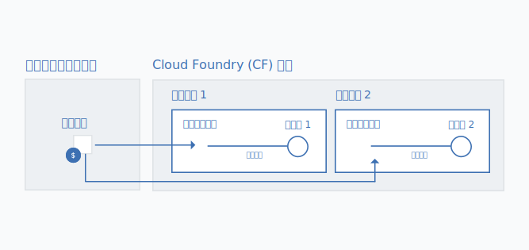

---

copyright:

  years: 2017, 2018

lastupdated: "2018-06-11"

---

{:shortdesc: .shortdesc}
{:codeblock: .codeblock}
{:screen: .screen}
{:new_window: target="_blank"}
{:gif: data-image-type='gif'}
{:tip: .tip}

# リソース・グループへの Cloud Foundry サービス・インスタンスのマイグレーション
{: #migrate}

ユーザーの {{site.data.keyword.Bluemix}} の使用経験をよりシンプルでフレキシブルなものにするために、概念的に Cloud Foundry のスペースに類似する[リソース・グループ](/docs/resources/resourcegroups.html#rgs)を導入しました。ただし、リソース・グループには、IBM Cloud Identity and Access Management (IAM) を使用したきめ細かいアクセス制御、さまざまな地域にわたってアプリおよびサービスにサービス・インスタンスを接続する機能、およびグループごとの使用量の容易な表示方法など、いくつかの追加の利点が含まれています。
{:shortdesc}

弊社では、リソース・グループの利点を活用するために Cloud Foundry からのサービスの移動を開始しています。つまり、ご使用のダッシュボード上でサービスの横に  アイコンが表示されている場合は、現在の Cloud Foundry の組織およびスペースからリソース・グループにサービス・インスタンスを移動するためのマイグレーション計画を開始する必要があります。{{site.data.keyword.Bluemix_notm}} サービスを Cloud Foundry の組織、スペース、および役割の使用から IAM およびリソース・グループの使用に移行するまでは、既存の Cloud Foundry サービス・インスタンスをリソース・グループにマイグレーションすることはできません。

既存の Cloud Foundry サービス・インスタンスをリソース・グループにマイグレーションする場合、選択したグループをマイグレーション完了後に変更することはできません。 したがって、マイグレーションの前に、アカウント内のリソースをどのように編成するかを計画することが重要です。これは、請求可能アカウントをお持ちの場合、マイグレーションの前に 1 つ以上のリソース・グループを作成する必要があることを意味する場合があります。 

Cloud Foundry スペースでのリソースの編成と同じ方法で、リソース・グループ内のリソースを編成してみることができます。リソース・グループの使用について詳しくは、『[リソースをリソース・グループに編成するためのベスト・プラクティス](/docs/resources/bestpractice_rgs.html#bp_resourcegroups)』を参照してください。
{: tip}

## サービス・インスタンスをマイグレーションする理由

Cloud IAM アクセス制御およびリソース・グループ内の組織をサポートするサービスには、以下のような利点があります。

* きめ細かなアクセス制御の使用により、個々のサービス・インスタンス、またはリソース・グループ内に編成されたリソースのグループへのアクセス権を設定できます。 
* アクセス・グループとリソース・グループを使用してユーザーとリソースを編成することにより、最小数のアクセス・ポリシーのみを設定します。例えば、開発者の一団がおり、その全員に開発環境のリソースへのアクセス権を付与したい場合は、それらのユーザー全員を開発者アクセス・グループに編成し、次に、彼らがアクセスする必要があるすべてのリソースを単一のリソース・グループに編成できます。それから、そのアクセス・グループにリソース・グループ内のすべてのリソースへのアクセス権限を付与する単一ポリシーを設定できます。
* リソース・グループの使用量は、Cloud Foundry 組織の使用量を表示するのと同様の方法で表示できます。
* 任意の Cloud Foundry のスペース内のアプリおよびサービスに接続できます。これにより、さまざまな地域からのアプリおよびサービスの接続が可能になります。マイグレーションすると、元の Cloud Foundry サービス・インスタンスを別名にし、選択したリソース・グループ内に、リンクされたインスタンスを作成することによって、自動的に接続が行われます。以下の図形は、別名を使用して接続がどのように機能するかを示しています。

## サービス・インスタンスをマイグレーションできるユーザー
{: #whocanmigrate}

Cloud Foundry サービス・インスタンスをリソース・グループにマイグレーションするには、ユーザーは特定のアクセス権限を持っている必要があります。

* ユーザーは、Cloud Foundry スペースに対する開発者役割、または、インスタンスが属する組織に対する組織管理者 Cloud Foundry 役割を持っている必要があります。
* ユーザーは、インスタンスのマイグレーション先リソース・グループを管理するために、少なくともビューアー IAM 役割を持っている必要があります。
* ユーザーは、サービスに対して少なくともエディター IAM 役割を持っている必要があります。

正しいアクセス権限の割り当てについて詳しくは、『[Cloud Foundry アクセス権限](/docs/iam/cfaccess.html#cfaccess)』および『[IAM アクセス権限](/docs/iam/users_roles.html#platformrolestable)』を参照してください。

自分が持っているアクセス権限を確認するには、コンソールのメニュー・バーで**「管理」**&gt; **「セキュリティー」** &gt; **「ID およびアクセス」**をクリックし、**「ユーザー」**をクリックします。次に、自分の名前をクリックして、割り当てられている IAM 役割の**「アクセス・ポリシー」**を確認し、アクセスできる組織および割り当てられている Cloud Foundry 役割を**「Cloud Foundry アクセス権限」**で確認します。
{: tip}

## マイグレーションの仕組み

サービス・インスタンスを Cloud Foundry の組織とスペースからリソース・グループにマイグレーションすると、新しくリンクされたサービス・インスタンスがリソース・グループ内に作成されます。 Cloud Foundry の組織とスペース内の元のインスタンスは[別名](/docs/resources/connecting_apps.html#what_is_alias)になります。 別名は、組織の割り当て量に計上されますが、請求対象になるのはリソース・グループ内のサービス・インスタンスの使用です。

{: gif}

サービス・インスタンスのマイグレーションは、Cloud Foundry サービス・インスタンスに関連付けられた  アイコンによってダッシュボードで通知されたら、一度に 1 つずつ行うことができます。

マイグレーション・プロセスを開始する前に、ご使用のサービスの資料を調べて、サービス・インスタンスをリソース・グループにマイグレーションするときに行わなければならない可能性のある、追加のサービス固有の変更がないか確認してください。例えば、古いインスタンスから新しいインスタンスにデータをマイグレーションしたり、Cloud Foundry 別名を削除する場合、アプリに使用していた資格情報を更新したりする必要がある場合があります。マイグレーションされているサービスの API に直接呼び出しを行うアプリケーションは、IAM の API キーまたはアクセス・トークンを使用するように API 呼び出しを更新する必要があります。
{: tip}

1. **「その他のアクション」**メニューを開きます。
2. **「リソース・グループへのマイグレーション (Migrate to a resource group)」**を選択して開始します。
3. リソース・グループを選択します。
4. **「マイグレーション」**をクリックします。そうすると、インスタンスがマイグレーションされます。
5. 一度にマイグレーションできるインスタンスは 1 つのみであるため、最初のマイグレーションが終わったら、マイグレーション可能なインスタンスのマイグレーションを続けることができます。

インスタンスが正常にマイグレーションされたら、ダッシュボードの「サービス」セクションでそれが反映されたことを確認できます。 別名は、ダッシュボードの「Cloud Foundry」セクションに残ります。 ダッシュボードの Cloud Foundry セクションで  を使用して、別名を識別できます。

## 次のステップ
{: #nextsteps}

Cloud Foundry サービス・インスタンスをリソース・グループにマイグレーションした後、アカウント・リソース・グループ内のリソースに対する必要なレベルのアクセス権限が、アカウント内のユーザーに付与されていることを確認する必要があります。また、ユーザーがアカウント・リソース・グループ内に新しいサービス・インスタンスを作成できるように、リソース・グループを管理するためのアクセス権限を提供することもできます。

リソース・グループ内のリソースへのアクセス権限の割り当てについて詳しくは、『[リソース・グループおよびリソース・グループ内のリソースへのアクセス権限の割り当て](/docs/resources/bestpractice_rgs.html#assigning-access-to-resource-groups-and-the-resources-within-them)』を参照してください。

また、ご使用のサービスの資料を必ず調べて、マイグレーション完了後に既存のアプリの更新を行う必要があるかどうか確認してください。 

## トラブルシューティング

Cloud Foundry サービス・インスタンスのマイグレーションで問題が発生した場合は、『[サービス・インスタンスのマイグレーションに関するトラブルシューティング](/docs/resources/ts_migration.html)』を参照してください。
